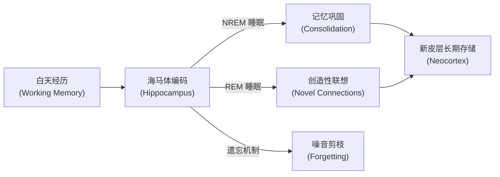
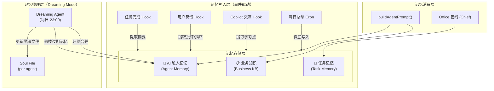

# AI 记忆系统 — 科学化大脑架构

## 背景

当前系统的知识存储存在两个问题：
1. **任务内容与业务知识混在一起**：KnowledgeItem / TaskContext 无分类
2. **AI 没有学习能力**：做完任务就忘了，不能从错误中学习

你的 CTO 提出的 "Dreaming Mode" 有强大的脑科学理论支撑：

### 🧠 脑科学基础：海马体记忆回放（Hippocampal Replay）



- **NREM 回放**：大脑在深度睡眠中以高速重放白天的神经序列，加强重要记忆 → 对应我们的 **每日总结归纳**
- **REM 做梦**：产生新的联想和连接 → 对应 **Dreaming Agent 交叉关联不同任务的经验**
- **选择性遗忘**：只保留有奖励信号/新颖性的记忆 → 对应 **按重要性打分，低分记忆过期淘汰**

---

## 系统架构



---

## Proposed Changes

### 1. 记忆存储 — 文件系统结构

保持与现有 `loadAgentContext()` 兼容，用文件系统存储（不改 Prisma schema）：

```
public/characters/bristh_{agent}/
├── config.json              # 人设配置
├── context/                 # 📋 业务知识（已有）
│   └── proposal_standards.md
├── memory/                  # 🧠 AI 私人记忆（新增）
│   ├── soul.md              # 灵魂文件（Dreaming Agent 维护）
│   ├── 2025-08-15.jsonl     # 当日原始记忆条目
│   └── 2025-08-14.jsonl     # 昨日原始记忆条目
└── task_memory/             # 📝 任务记忆（新增）
    └── {taskId}.md          # 从任务结果中提取的摘要
```

#### 记忆条目格式（JSONL）

```json
{"ts":"2025-08-15T14:30:00Z","type":"task_feedback","source":"user","content":"用户指出：邮件格式不对，应该用英文正式格式","importance":0.8}
{"ts":"2025-08-15T15:00:00Z","type":"lesson_learned","source":"self","content":"生成PPT时JSON格式出错，需要检查嵌套引号转义","importance":0.6}
{"ts":"2025-08-15T16:00:00Z","type":"user_preference","source":"user","content":"用户偏好：署名使用 BEP office AI team","importance":0.9}
```

---

### 2. 知识库 UI 改造 — 3 Tab 结构

#### [MODIFY] KB 页面（`/AIkb` 或 `/kb`）

```
┌──────────────────────────────────────────────┐
│  📋 业务知识  |  📝 任务记忆  |  🧠 AI私人记忆  │
├──────────────────────────────────────────────┤
│                                              │
│  Tab 1: 业务知识                              │
│  ├── [+ 新建知识] [⬆ 上传文件] [📋 粘贴文本]  │
│  ├── 行业背景.md                              │
│  ├── 客户资料.md                              │
│  └── 合作方案模板.md                           │
│                                              │
│  Tab 2: 任务记忆                              │
│  ├── 任务A - Alice方案摘要                     │
│  ├── 任务B - Edda PPT结果                     │
│  └── 任务C - Hugo财务分析                      │
│                                              │
│  Tab 3: AI私人记忆                            │
│  ├── 👩 Alice                                 │
│  │   ├── 灵魂文件 (soul.md)                   │
│  │   ├── 今日记忆 (3条)                       │
│  │   └── 历史记忆 (12条)                      │
│  ├── 👨 Hugo                                  │
│  │   └── ...                                 │
│  └── 👩 Iris                                  │
│      └── ...                                 │
└──────────────────────────────────────────────┘
```

---

### 3. 记忆写入 — 事件 Hook 系统

#### [NEW] `src/lib/memory-engine.ts`

核心记忆引擎，提供以下函数：

```typescript
// 写入一条记忆
async function writeMemory(agentId: string, entry: MemoryEntry): Promise<void>

// 从任务结果提取记忆（任务完成 Hook）
async function extractTaskMemory(agentId: string, taskResult: string, taskInstruction: string): Promise<void>

// 从用户反馈提取记忆（反馈 Hook）
async function extractFeedbackMemory(agentId: string, userMessage: string): Promise<void>

// 读取 agent 的所有活跃记忆
async function loadAgentMemories(agentId: string, limit?: number): Promise<MemoryEntry[]>

// 读取灵魂文件
async function loadSoulFile(agentId: string): Promise<string>
```

**触发时机**：

| 事件 | 触发点 | 写入内容 |
|---|---|---|
| 任务完成 | Agent route 返回 `COMPLETED` 后 | 任务摘要 + 关键学习点 |
| 用户审批反馈 | `handleApproveTask` 中 | 用户的修改意见 / 批评 |
| Copilot 修改 | Toolbox AI Chat 中 | 用户的修改指令（说明偏好） |
| 每日总结 | Cron 23:00 | Dreaming Agent 归纳当日所有记忆 |

---

### 4. Dreaming Agent — 每日记忆整理

#### [NEW] `src/app/api/cron/dreaming/route.ts`

一个不面向用户的特殊系统 Agent。每日执行：

```
1. 遍历所有 Agent
2. 读取该 Agent 当日的原始记忆（memory/YYYY-MM-DD.jsonl）
3. 用 LLM 做"梦境回放"：
   Prompt: "你是 {Agent} 的潜意识系统。你刚做了一个梦，梦里回放了今天的经历：
   {当日记忆列表}
   
   请执行以下整理操作：
   1. 归纳总结：今天学到了什么？有什么模式？
   2. 更新灵魂文件：哪些经验应该永久记住？
   3. 遗忘建议：哪些记忆不重要，可以标记为过期？
   4. 交叉联想：不同任务之间有什么关联可以利用？
   
   输出 JSON：{ soulUpdate: string, pruneIds: string[], insights: string }"
4. 合并更新到 soul.md
5. 标记低价值记忆为 archived
```

#### 灵魂文件示例（`soul.md`）

```markdown
# Alice 的灵魂文件
> 最后更新: 2025-08-15 by Dreaming Agent

## 核心能力认知
- 我擅长写结构清晰的商业方案，用户对我的条理性评价高
- 当任务涉及英国教育市场时，我应该参考 Myddelton 和 Bournemouth 的案例

## 已学教训
- 用户要求中英双语时，不要翻译人名和学校名
- 署名统一用 "BEP office AI team"，不用个人名
- 方案格式：先背景 → 再方案 → 最后时间表

## 用户偏好
- 刘女士偏好简洁直接的沟通风格
- 文档默认用中文，邮件用英文

## 协作模式
- 我的产出通常会传给 Edda 做 PPT 和 Grace 发邮件
- 需要确保方案的核心要点在前3段，方便 Edda 提取
```

---

### 5. 改造 `buildAgentPrompt` — 注入记忆

#### [MODIFY] `src/lib/bristh-config.ts`

```diff
 export async function buildAgentPrompt(...) {
   const config = await loadAgentConfig(agentId);
   const privateContext = await loadAgentContext(agentId);
+  const soulFile = await loadSoulFile(agentId);
+  const recentMemories = await loadAgentMemories(agentId, 10);
   
   let prompt = `${persona}\n\n...`;
   
   if (privateContext) {
     prompt += `\n\nReference knowledge:\n${privateContext}`;
   }
+  
+  if (soulFile) {
+    prompt += `\n\n【Your accumulated experience and learnings (Soul File)】:\n${soulFile}`;
+  }
+  
+  if (recentMemories.length > 0) {
+    const memStr = recentMemories.map(m => `- [${m.type}] ${m.content}`).join('\n');
+    prompt += `\n\n【Recent memories from past tasks】:\n${memStr}`;
+  }
   
   return prompt;
 }
```

---

### 6. 新增 API Routes

| Route | 说明 |
|---|---|
| [NEW] `api/memory/write` | 写入记忆条目 |
| [NEW] `api/memory/[agentId]` | 读取某 agent 的记忆 |
| [NEW] `api/memory/soul/[agentId]` | 读写灵魂文件 |
| [NEW] `api/cron/dreaming` | Dreaming Agent（可被 Vercel Cron 或手动触发） |

---

## Open Questions

> [!IMPORTANT]
> **灵魂文件的写权限**：Dreaming Agent 自动更新 soul.md，但用户/管理员是否也能手动编辑灵魂文件？（建议：可以，相当于给 AI "矫正记忆"）

> [!NOTE]
> **记忆保留期**：原始记忆条目（JSONL）保留多久？建议：
> - 高重要性（>0.7）：永久保留
> - 中等（0.4-0.7）：保留 30 天
> - 低（<0.4）：7 天后自动清理

> [!NOTE]
> **Dreaming Cron 频率**：每天 23:00 执行一次？还是你希望更频繁（如每 6 小时）？每次执行会消耗一次 LLM 调用（per agent），按 9 个 agent 约 9 次调用/天。

## 实施顺序

建议分 3 个阶段：

### Phase 1: 存储层 + KB UI（1-2 天）
1. 创建 `memory-engine.ts`（文件系统读写）
2. 改造 KB 页面为 3 Tab 结构
3. 创建 memory API routes

### Phase 2: 事件 Hook + Prompt 注入（1 天）
4. 在各 Agent route 的任务完成后调用 `extractTaskMemory`
5. 在 Office 审批流中调用 `extractFeedbackMemory`
6. 改造 `buildAgentPrompt` 注入 soul + memories

### Phase 3: Dreaming Agent（半天）
7. 实现 Dreaming Agent 的 cron route
8. 配置 Vercel Cron 或手动触发
9. 验证灵魂文件的自动更新

## Verification Plan

### Manual Verification
1. 在 KB 页面验证 3 Tab 切换正常，数据分类正确
2. 执行一个任务 → 检查 task_memory/ 目录是否生成记忆文件
3. 给出反馈 → 检查 memory/ 目录是否写入反馈条目
4. 手动触发 Dreaming Agent → 检查 soul.md 是否更新
5. 再次执行任务 → 验证 buildAgentPrompt 是否注入了 soul + memories
