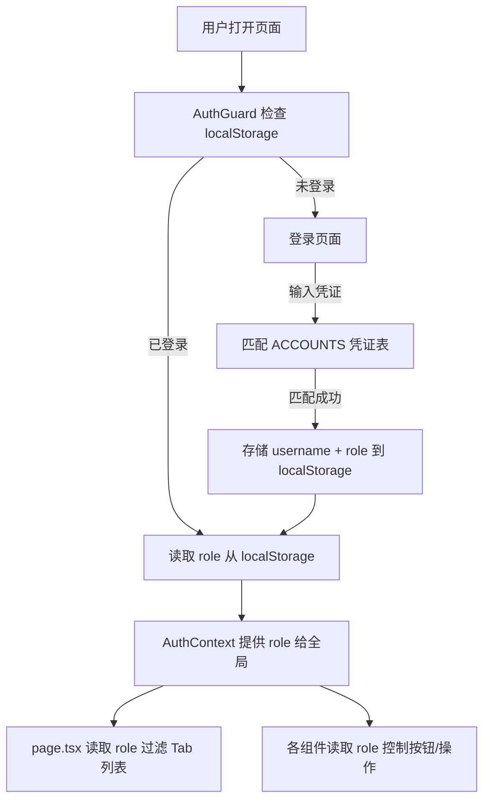

# 账号系统 & 分级权限

## 背景

当前系统使用一个硬编码的单账号（`haoz214` / `198749`）做前端 localStorage 验证，没有角色概念，所有功能对登录用户完全开放。

**目标**：支持多账号 + admin/user 两级权限，admin 能看到所有功能，user 只能看到部分功能。

## 设计决策

> [!IMPORTANT]
> **不引入数据库用户表和 JWT**。你现在的认证是纯前端 localStorage + 硬编码凭证，架构极简。为了保持一致性和快速落地，我计划同样使用**前端凭证表 + localStorage 存角色信息**的方案。后续如果需要真正的后端鉴权，可以再迁移到 NextAuth + Prisma User 表。

## 开放问题

> [!WARNING]
> 1. **User 账号的用户名和密码你想设成什么？** 比如 `user` / `bristh2026`？还是需要多个 user 账号？
> 2. **User 能看到哪些 Tab？** 我目前的默认方案是：
>    - ✅ 虚拟办公室（只读，不能提交任务）
>    - ✅ AI员工（可以正常对话）
>    - ✅ 任务历史（只能看，不能删）
>    - ✅ 知识库（只读）
>    - ❌ AI配置与装配
>    - ❌ Toolbox 工具箱
>    - ❌ Skill 管理
>    - ❌ 架构白皮书
> 3. **User 在虚拟办公室里能不能提交新任务？** 还是只能看到已有任务的状态？

## 方案设计

### 架构图



### 变更文件

---

#### [MODIFY] [AuthGuard.tsx](file:///Users/aisandbox/Documents/myAI/src/components/auth/AuthGuard.tsx)

- 将单凭证改为**凭证数组** `ACCOUNTS`，每个账号带 `username`, `password`, `role`
- 登录成功后在 localStorage 存入 `{ username, role }` 而非简单的 `'true'`
- `AuthContext` 扩展为 `{ role: 'admin' | 'user'; username: string; logout: () => void }`

```typescript
const ACCOUNTS = [
  { username: 'haoz214', password: '198749', role: 'admin' as const },
  { username: 'user',    password: 'bristh2026', role: 'user' as const },
];
```

---

#### [MODIFY] [page.tsx](file:///Users/aisandbox/Documents/myAI/src/app/page.tsx)

- 从 `AuthContext` 读取 `role`
- Tab 列表增加 `adminOnly?: boolean` 字段
- 渲染时根据 role 过滤不可见的 Tab
- 虚拟办公室中的「新建任务」按钮对 user 隐藏或禁用

---

#### [NEW] [src/lib/roles.ts](file:///Users/aisandbox/Documents/myAI/src/lib/roles.ts)

集中定义角色权限常量，方便全局复用：

```typescript
export type UserRole = 'admin' | 'user';

export const TAB_PERMISSIONS: Record<string, UserRole[]> = {
  office:    ['admin', 'user'],
  employees: ['admin', 'user'],
  history:   ['admin', 'user'],
  kb:        ['admin', 'user'],
  settings:  ['admin'],
  toolbox:   ['admin'],
  skills:    ['admin'],
  logic:     ['admin'],
};

export function canAccess(tab: string, role: UserRole): boolean {
  return TAB_PERMISSIONS[tab]?.includes(role) ?? false;
}
```

## 验证计划

### 手动验证
1. 用 admin 账号登录 → 所有 Tab 可见
2. 退出 → 用 user 账号登录 → 只看到 4 个 Tab
3. User 点击 AI员工 → 能正常对话
4. User 在虚拟办公室中 → 看不到新建任务按钮
5. 刷新页面 → 登录状态和角色保持
