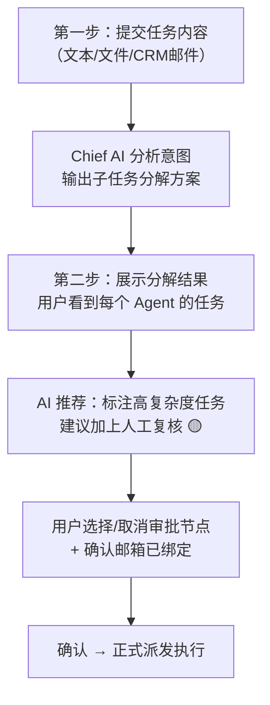
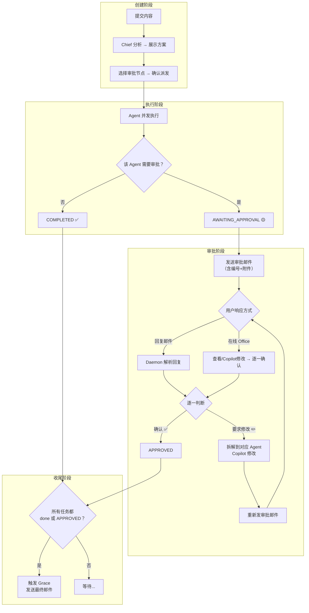

# 🔄 Human-in-the-Loop 审批闭环优化 (v2)

根据你的反馈做了重大调整，特别是创建任务的交互流程。

---

## ⚠️ 现存设计问题坦白

在读代码的过程中，我发现了一个你需要知道的问题：

> [!WARNING]
> **Grace 目前是硬编码为"最后一步"的，不是动态管线。**
> 
> 具体来说，在 3 个地方硬编码了 Grace 的特殊逻辑：
> 1. [office/page.tsx L162](file:///Users/aisandbox/Documents/myAI/src/app/(dashboard)/office/page.tsx#L162): `depth: t.agent.toLowerCase() === 'grace' ? 2 : 1` — 硬编码 Grace depth=2
> 2. [office/page.tsx L167-221](file:///Users/aisandbox/Documents/myAI/src/app/(dashboard)/office/page.tsx#L167-L221): 前端把 Grace 单独过滤出来，等其他 Agent 完成后才执行
> 3. [email-daemon.ts L83-112](file:///Users/aisandbox/Documents/myAI/scripts/email-daemon.ts#L83-L112): 同样的硬编码逻辑
> 4. [agent_capabilities.yaml L77](file:///Users/aisandbox/Documents/myAI/public/characters/bristh_chief/agent_capabilities.yaml#L77): 文档中写了 "Grace 应该始终是管线中最后执行的 Agent"
> 
> 也就是说，Chief AI 编排时并不真正决定执行顺序 —— 前端和 daemon 已经写死了"Grace 一定最后"。如果未来你想让管线顺序完全由 AI 动态决定（比如某些场景 Grace 不需要最后执行），这需要一个更根本的重构。
> 
> **本次优化中我的处理方式**：保持 Grace 硬编码为最后一步的现状不变，但把审批检查点插入到 Grace 之前。这样 Grace 的触发条件变成：**所有其他任务要么 `done`（无需审批）要么 `APPROVED`（已审批通过）**。如果你同意，我们可以在后续版本中再考虑把执行顺序做成真正的动态管线。

---

## 核心产品逻辑 v2

### 两步式创建任务流程

你的第3点反馈改变了整个创建流程的设计。原来是"一步提交"，现在变成：



**关键区别**：
- 用户不是在"盲选"哪些 Agent 需要审批 —— 而是在看到 Chief 的实际分解方案后，结合 AI 推荐，做出明智的审批决策
- 如果用户选了 "Alice 需要审批" 但 Chief 没有分派 Alice，那个选择就自然被忽略
- Chief 分析时会同时输出一个 `complexity` 评分，用来推荐哪些任务建议审批

### 完整闭环



---

## User Review Required

> [!IMPORTANT]
> **Grace 硬编码问题**：上面已经说明了现状。你同意这次先保持现状（Grace 硬编码最后），只把审批闭环加进去吗？动态管线顺序可以作为后续优化？

> [!IMPORTANT]
> **两步流程的实现方式**：我打算把 new-task 页面改成两步式（Step 1: 提交内容 → Step 2: 审批选择）。这意味着原来"一键派发跳转到 office"的体验会变成"提交 → 等 AI 分析 2-3 秒 → 看方案 → 确认"。你觉得这个多出来的等待步骤可以接受吗？

---

## Proposed Changes

### 数据模型 (Prisma Schema)

#### [MODIFY] [schema.prisma](file:///Users/aisandbox/Documents/myAI/prisma/schema.prisma)

```diff
 model Task {
   id             String      @id @default(cuid())
   contextId      String
   agent          String
   instruction    String
   status         String      @default("PENDING")
+  requiresApproval Boolean   @default(false)
   resultPayload  String?
   createdAt      DateTime    @default(now())
   updatedAt      DateTime    @updatedAt
   copilotHistory String?
   thinkLog       String?
   toolCallsLog   String?
   context        TaskContext @relation(fields: [contextId], references: [id])
 }

 model TaskContext {
   id         String   @id @default(cuid())
   source     String
   rawContent String
   parsedData String?
   modelUsed  String?
   userId     String?
+  approvalConfig  String?   // JSON: ["Alice", "Eric"] — 用户选择需要审批的 Agent
+  approvalEmailId String?   // 邮件 Message-ID，用于追踪审批回复
+  pipelineStatus  String    @default("ACTIVE")  // ACTIVE | AWAITING_APPROVAL | ALL_APPROVED | COMPLETED
   createdAt  DateTime @default(now())
   tasks      Task[]
   user       User?    @relation(fields: [userId], references: [id])
 }
```

**新增的 Task 状态流转**：
```
PENDING → RUNNING → COMPLETED (无需审批)
PENDING → RUNNING → AWAITING_APPROVAL → APPROVED (需要审批)
PENDING → RUNNING → AWAITING_APPROVAL → REVISION → AWAITING_APPROVAL → APPROVED (需修改后重新审批)
```

---

### 创建任务页面 —— 两步式重构

#### [MODIFY] [new-task/page.tsx](file:///Users/aisandbox/Documents/myAI/src/app/(dashboard)/new-task/page.tsx)

**大幅重构为两步流程**：

**Step 1 — 提交内容**（保留现有 UI 风格）：
- 文本录入 / 上传文件 / 关联 CRM 邮件（与现有一致）
- 按钮文案改为 "下一步：AI 分析" 而非 "派发任务"
- 点击后调用新的 `/api/bristh/orchestrate/analyze` 接口（只分析不执行）

**Step 2 — 审批配置**（新增 UI）：
- 展示 Chief 的分解方案：每个被分配的 Agent 卡片，显示名称 + 被分配的 instruction 摘要
- AI 推荐标注：高复杂度任务旁边显示 🟡 "建议人工复核" 标签
- 每个 Agent 卡片带一个 toggle 开关："需要人工审批"
- 底部：邮箱绑定检查
  - 如果没有勾选任何审批 → 直接显示"确认派发"
  - 如果勾选了审批 → 检查用户邮箱：
    - 已绑定 → 显示"审批通知将发送至 xxx@gmail.com"
    - 未绑定 → 显示内联输入框让用户绑定邮箱
- "确认派发" 按钮 → 调用 `/api/bristh/orchestrate/confirm` 正式创建 Task 并开始执行

---

### 编排 API —— 拆分为两步

#### [MODIFY] [orchestrate/route.ts](file:///Users/aisandbox/Documents/myAI/src/app/api/bristh/orchestrate/route.ts)

拆分原有的 POST 为两个阶段：

**阶段 1: `POST /api/bristh/orchestrate/analyze`** （新路由文件）
- 接收 `rawContent`，调用 Chief AI 分析意图
- Chief 输出增强：除了 `{tasks: [{agent, instruction}]}` 外，新增 `complexity` 字段：
  ```json
  {
    "tasks": [
      { "agent": "Alice", "instruction": "...", "complexity": "high", "reason": "涉及商业方案，内容较复杂" },
      { "agent": "Bob", "instruction": "...", "complexity": "low", "reason": "简单的日程安排" },
      { "agent": "Eric", "instruction": "...", "complexity": "high", "reason": "法律文书需要准确性" }
    ]
  }
  ```
- 创建 TaskContext（状态 = DRAFT），但**不创建 Task 记录**
- 返回分析结果给前端展示

**阶段 2: `POST /api/bristh/orchestrate/confirm`** （新路由文件）
- 接收 `contextId` + `approvalConfig`（用户选的需要审批的 Agent 列表）
- 正式创建 Task 记录，对在 approvalConfig 中的 Agent 设置 `requiresApproval: true`
- 更新 TaskContext 的 `approvalConfig`
- 返回创建好的 tasks 给前端开始执行

原来的 `POST /api/bristh/orchestrate`（单步）保留作为 email-daemon 的入口（新邮件触发的全自动流程），但也加上审批逻辑。

---

### Office 看板页面

#### [MODIFY] [office/page.tsx](file:///Users/aisandbox/Documents/myAI/src/app/(dashboard)/office/page.tsx)

**改动 1：Agent 执行完毕后的状态分流**

`executeAgent` 函数修改（[L170-215](file:///Users/aisandbox/Documents/myAI/src/app/(dashboard)/office/page.tsx#L170-L215)）：
- 执行完成后，检查该 Task 的 `requiresApproval`
- 如果 `true` → 状态设为 `awaiting_approval` 而非 `done`
- 如果 `false` → 保持 `done`

**改动 2：Kanban 卡片新增"待审批"状态**

[L600-670](file:///Users/aisandbox/Documents/myAI/src/app/(dashboard)/office/page.tsx#L600-L670) 附近，新增：
- `awaiting_approval` 状态样式：**黄色/琥珀色边框**，显示 🟡 图标
- 卡片底部显示两个按钮：
  - "👁 查看 Draft" → 打开 Copilot 查看/修改产物
  - "✅ 批准通过" → 调用 `/api/bristh/approve`
- Hover 提示："此任务需要您的人工确认才能继续"

**改动 3：Grace 启动条件修改**

[L217-222](file:///Users/aisandbox/Documents/myAI/src/app/(dashboard)/office/page.tsx#L217-L222)：
- 原逻辑：等 otherTasks 的 `Promise.all` 完成后启动 Grace
- 新逻辑：等 otherTasks 完成后，检查是否有 `awaiting_approval` 状态的任务
  - 有 → 不启动 Grace，显示 "⏸️ Grace 等待审批完成后执行"
  - 没有 → 正常启动 Grace
- 当最后一个 `awaiting_approval` 任务被 approve 后，自动触发 Grace

---

### 新增 API 路由

#### [NEW] [approve/route.ts](file:///Users/aisandbox/Documents/myAI/src/app/api/bristh/approve/route.ts)

**审批接口**：
```
POST /api/bristh/approve
Body: { taskId: string }
```
- 将指定 Task 从 `AWAITING_APPROVAL` → `APPROVED`
- 检查同 Context 下是否**所有需要审批的 Task 都已 APPROVED**
- 如果是 → 更新 `pipelineStatus = ALL_APPROVED`，返回 `{ allApproved: true }`
- 前端收到 `allApproved: true` 后自动触发 Grace

#### [NEW] [notify/route.ts](file:///Users/aisandbox/Documents/myAI/src/app/api/bristh/notify/route.ts)

**审批通知邮件**：
```
POST /api/bristh/notify
Body: { contextId: string }
```
- 查询该 Context 下所有 `AWAITING_APPROVAL` 的任务
- 查询 Context 所属用户的邮箱
- 构建邮件内容：

```
主题：[Autoffice] 有 N 项任务需要您的审批确认

您好 {displayName}，

以下任务已完成初稿，等待您的确认：

━━━━━━━━━━━━━━━━━━━━━━━━━━━━━━
📌 任务 #1 — Alice (方案架构师)
指令：撰写国际教育合作企划书
摘要：[产物的前100字摘要]
附件：Alice_Document.doc
━━━━━━━━━━━━━━━━━━━━━━━━━━━━━━
📌 任务 #2 — Eric (法务写作专员)  
指令：起草 NDA 和合作草案
摘要：[产物的前100字摘要]
附件：Eric_Document.doc
━━━━━━━━━━━━━━━━━━━━━━━━━━━━━━

📋 操作方式：
• 登入系统查看详情并在线审批：http://xxx/office
• 或直接回复本邮件，按编号说明：
  - 确认某项：回复 "#1 确认" 或 "#1 OK"
  - 修改某项：回复 "#1 请将第二段的数据改为..." 
  - 全部确认：回复 "全部确认"
```

- 设置 `Message-ID` header 并保存到 `TaskContext.approvalEmailId`
- 附件：收集所有待审批任务的产物文件

#### [NEW] [approval-reply/route.ts](file:///Users/aisandbox/Documents/myAI/src/app/api/bristh/approval-reply/route.ts)

**邮件回复解析 API**：
```
POST /api/bristh/approval-reply
Body: { contextId: string, replyContent: string }
```
- 用 AI 解析用户的回复邮件内容
- AI 的 system prompt 引导它按编号匹配：
  ```
  用户的回复可能包含对多个任务的反馈。请逐一解析：
  - 输出 JSON 数组：[{ "taskNumber": 1, "action": "approve" | "revise", "feedback": "修改说明..." }]
  ```
- 对于 `action: "approve"` → 调用 approve 逻辑
- 对于 `action: "revise"` → 调用对应 Agent 的 copilot API，传入 feedback
  - Copilot 修改完成后，将该 Task 状态重置为 `AWAITING_APPROVAL`
  - 触发重新发送审批通知邮件（新一轮循环）

---

### 邮件守护进程

#### [MODIFY] [email-daemon.ts](file:///Users/aisandbox/Documents/myAI/scripts/email-daemon.ts)

**改动内容**：在 `pollEmails` 中增加审批回复识别逻辑：

```
收到新邮件
  ├── 检查 In-Reply-To / References header
  │     ├── 匹配到某个 TaskContext.approvalEmailId
  │     │     → 调用 POST /api/bristh/approval-reply（审批回复流程）
  │     │
  │     └── 不匹配
  │           → 走原有的 POST /api/bristh/orchestrate（新任务流程）
```

- 判断方式：解析邮件的 `In-Reply-To` header，查数据库匹配 `approvalEmailId`
- 审批通知邮件独立于 Grace 的管线（不在 Kanban 中显示），只是一个通知机制

---

## 关于审批通知邮件 vs Grace 管线邮件的区别

| | 审批通知邮件 (notify) | Grace 管线邮件 |
|---|---|---|
| **发给谁** | 系统用户（内部人员） | 外部客户 |
| **目的** | 人工审批确认 | 商务沟通 |
| **是否在管线中** | ❌ 不显示在 Kanban | ✅ 显示在 Kanban |
| **触发时机** | Agent 完成 + 需要审批时 | 所有审批通过后 |
| **附件** | 待审批的产物 | 所有 Agent 的最终产物 |

---

## 文件修改总览

| 文件 | 类型 | 改动概述 |
|---|---|---|
| [schema.prisma](file:///Users/aisandbox/Documents/myAI/prisma/schema.prisma) | MODIFY | Task +`requiresApproval`; TaskContext +`approvalConfig`, `approvalEmailId`, `pipelineStatus` |
| [new-task/page.tsx](file:///Users/aisandbox/Documents/myAI/src/app/(dashboard)/new-task/page.tsx) | **大改** | 两步式：Step1 提交 → Step2 AI分析结果+审批选择+邮箱检查 |
| [orchestrate/route.ts](file:///Users/aisandbox/Documents/myAI/src/app/api/bristh/orchestrate/route.ts) | MODIFY | 保留给 daemon 用，新增审批逻辑 |
| [analyze/route.ts](file:///Users/aisandbox/Documents/myAI/src/app/api/bristh/orchestrate/analyze/route.ts) | **NEW** | 阶段1：Chief 分析+复杂度评估，不执行 |
| [confirm/route.ts](file:///Users/aisandbox/Documents/myAI/src/app/api/bristh/orchestrate/confirm/route.ts) | **NEW** | 阶段2：接收审批配置，创建 Task，开始执行 |
| [office/page.tsx](file:///Users/aisandbox/Documents/myAI/src/app/(dashboard)/office/page.tsx) | MODIFY | 新增待审批卡片状态+审批按钮+Grace 条件修改 |
| [approve/route.ts](file:///Users/aisandbox/Documents/myAI/src/app/api/bristh/approve/route.ts) | **NEW** | 审批 API |
| [notify/route.ts](file:///Users/aisandbox/Documents/myAI/src/app/api/bristh/notify/route.ts) | **NEW** | 审批通知邮件发送 |
| [approval-reply/route.ts](file:///Users/aisandbox/Documents/myAI/src/app/api/bristh/approval-reply/route.ts) | **NEW** | 邮件回复解析+修改派发 |
| [email-daemon.ts](file:///Users/aisandbox/Documents/myAI/scripts/email-daemon.ts) | MODIFY | 区分审批回复 vs 新任务 |

---

## Verification Plan

### Automated Tests
- `npx prisma db push` 验证 schema 迁移
- `npm run build` 确认无编译错误

### Manual Verification
1. **两步创建流程** → 提交内容 → 看到 AI 分析结果 + 复杂度推荐 → 选择审批节点
2. **邮箱绑定拦截** → 勾选审批但未绑邮箱时，提示绑定
3. **审批拦截** → Agent 完成后，需审批的显示 🟡 待审批
4. **在线审批** → 逐一确认每个任务 → 全部通过后 Grace 自动触发
5. **审批邮件** → 检查邮件格式、编号、附件完整
6. **邮件回复确认** → 回复 "#1 确认" → 验证该任务被 approve
7. **邮件回复修改** → 回复 "#1 修改：请改为..." → 验证 copilot 执行 + 重发邮件
8. **Grace 等待** → 有待审批任务时 Grace 不执行，全部通过后自动执行
