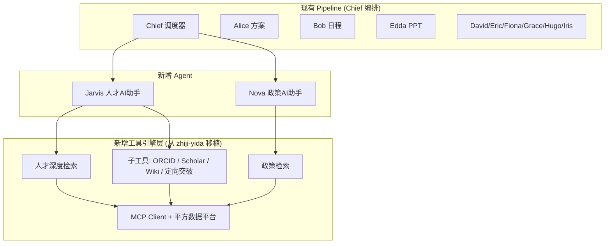

# 移植一答工具集 + 新增人才/政策 AI Agent 进入编排管线

## 背景

将 `zhiji-yida` 项目的 **tools-tester** 工具集（11 个专业工具）移植到 `myAI_a2` 的 `/toolbox` 页面，并将工具能力封装为两个新 Agent 角色加入 Chief 多智能体编排管线，使自动化能力从简单办公扩展到行业级专业工具调度。

> [!IMPORTANT]
> 核心理念：让平方工作台不再只是"文档 + PPT + 邮件"的办公自动化，而是能调度**行业深度工具**（人才验真、政策检索、ORCID 学术检索等）来解决专业问题的 AI 工作台。

---

## 架构总览



---

## 用户确认

> [!WARNING]
> **认证适配问题**：zhiji-yida 的工具依赖平方数据平台的 MCP token（`VISIONSQUARE_AUTH_BEARER`）。myAI_a2 自身使用 Prisma + `autoffice_session` cookie。
> 
> **方案**：工具 API 层统一使用 `VISIONSQUARE_AUTH_BEARER` 环境变量作为 fallback token 访问平方数据平台，不依赖用户 session。这意味着所有用户共享同一个数据平台访问权限。
> 
> 请确认这个方案是否可接受。

> [!IMPORTANT]
> **环境变量**：需要从 zhiji-yida 的 `.env.local` 复制以下配置到 myAI_a2：
> - `VISIONSQUARE_AUTH_BEARER` — 平方数据平台访问令牌
> - `BOCHA_API_KEY` — 博查搜索引擎 API
> - `ORCID_CLIENT_ID` / `ORCID_CLIENT_SECRET` — ORCID 学术检索
> - `SERPAPI_KEY` — Google Scholar 检索

---

## 五阶段实施计划

### Phase 1: MCP 基础设施移植

从 zhiji-yida 复制核心数据平台访问层到 myAI_a2。

#### [NEW] [client.ts](file:///Users/aisandbox/Documents/myAI_a2/src/lib/mcp/client.ts)
MCP JSON-RPC 客户端（管理 `dash-mcp` 二进制子进程通信）。直接复制，不需修改。

#### [NEW] [generated-tools.ts](file:///Users/aisandbox/Documents/myAI_a2/src/lib/mcp/generated-tools.ts)
自动生成的 1074 行类型化 MCP 工具包装器。直接复制。

#### [NEW] [talent.ts](file:///Users/aisandbox/Documents/myAI_a2/src/lib/mcp/talent.ts)
`TalentAuditService` — 平方学者库检索服务（673 行）。直接复制。

#### [NEW] [utils.ts](file:///Users/aisandbox/Documents/myAI_a2/src/lib/mcp/utils.ts)
MCP 二进制选择器。复制，但移除对 `redis` 和 `upsertDialogue` 的依赖（myAI_a2 不需要这些）。

#### [NEW] [types.ts](file:///Users/aisandbox/Documents/myAI_a2/src/lib/mcp/types.ts)
MCP 类型定义。

#### [NEW] bin/ 目录
复制 `dash-mcp-darwin-arm64` 等二进制文件到 `src/lib/mcp/bin/`。

#### [NEW] [search.ts](file:///Users/aisandbox/Documents/myAI_a2/src/lib/tools/search.ts)
统一搜索模块（阿里云大模型搜索 → Bocha 降级）。

#### [NEW] [disambiguation.ts](file:///Users/aisandbox/Documents/myAI_a2/src/lib/tools/disambiguation.ts)
862 行的人才同名消歧模块（LCS 机构匹配 + Embedding 领域 + 合作者 Jaccard）。

#### [NEW] [orcid_funcs.ts](file:///Users/aisandbox/Documents/myAI_a2/src/lib/tools/orcid_funcs.ts)
ORCID API 查询函数集。

---

### Phase 2: 工具 API 路由

在 myAI_a2 创建精简版 API 路由，复用 Phase 1 的基础设施。所有路由统一使用 `VISIONSQUARE_AUTH_BEARER` 作为 token（不依赖 zhiji 的 `getToken`）。

#### [NEW] 6 个子工具路由

| 路由 | 功能 | 来源 |
|---|---|---|
| `api/tools/pingfang-search/route.ts` | 平方人才库检索 + V2消歧 | `tools-tester/pingfang-search` |
| `api/tools/pingfang-paper-search/route.ts` | 平方论文库检索 | `tools-tester/pingfang-paper-search` |
| `api/tools/orcid-search/route.ts` | ORCID 学者档案检索 | `tools-tester/orcid-search` |
| `api/tools/scholar-search/route.ts` | Google Scholar 学术检索 | `tools-tester/scholar-search` |
| `api/tools/wiki-baike-search/route.ts` | Wikipedia + 百度百科 | `tools-tester/wiki-baike-search` |
| `api/tools/targeted-internet-search/route.ts` | SerpAPI 定向突破 | `tools-tester/targeted-internet-search` |

#### [NEW] 2 个复合引擎路由

| 路由 | 功能 | 来源 |
|---|---|---|
| `api/tools/talent-deep-search/route.ts` | 人才 4+1 深度检索（调度上述子工具 + AI 组装报告） | `talentDeepSearch.ts` |
| `api/tools/policy-search/route.ts` | 政策三阶段检索（平方库 + 全网 + AI 报告） | `findPolicies.ts` |

**适配策略**：
- 移除 `talentJournal.saveTalentData()` 和 `policyJournal.savePolicyData()` 调用（myAI_a2 无这些日志表）
- 将 `getToken(req)` 替换为 `process.env.VISIONSQUARE_AUTH_BEARER`
- SSE 流式协议保持不变（`text/event-stream`）

---

### Phase 3: 前端 Toolbox UI 集成

将 11 个工具的前端 UI 集成到 myAI_a2 现有的 `/toolbox` 页面。

#### [MODIFY] [page.tsx](file:///Users/aisandbox/Documents/myAI_a2/src/app/(dashboard)/toolbox/page.tsx)
在现有 `ToolboxView` 的工具选择器中新增两个 tab：**人才检索** 和 **政策检索**。

#### [NEW] 前端组件 (src/components/tools/)

| 组件 | 功能 |
|---|---|
| `TalentDeepSearchPanel.tsx` | 人才深度检索 UI（输入姓名/机构 → SSE 日志 + AI 报告） |
| `PolicySearchPanel.tsx` | 政策检索 UI（输入主题/地区 → SSE 日志 + AI 报告） |

> 参考 zhiji-yida 的 `TalentDeepSearchTest.tsx` 和 `PolicySearchTest.tsx`，但 **不使用 Ant Design 的 Timeline 组件**，改用 myAI_a2 已有的 Lucide Icons + 自定义 CSS 风格，确保视觉一致性。

---

### Phase 4: 两个新 Agent 角色

创建 **Jarvis（人才AI助手）** 和 **Nova（政策AI助手）**，它们区别于其他 Agent 的核心特征是：**内部调用工具引擎**而非纯文本生成。

#### [NEW] Jarvis Agent

```
public/characters/bristh_jarvis/
├── config.json          # persona、模型配置
├── context/
│   └── talent_tools.md  # 工具使用说明与提示词
└── avatar/
    └── avatar.png       # 需要生成
```

**Jarvis 路由**: `api/bristh/agents/jarvis/route.ts`

工作模式：
1. 从用户指令中提取姓名、机构、研究方向等关键信息
2. 调用 `api/tools/talent-deep-search` 获取结构化数据
3. 将检索结果 + 原始指令交给 AI 生成最终报告
4. 输出 Markdown 格式报告

#### [NEW] Nova Agent

```
public/characters/bristh_nova/
├── config.json
├── context/
│   └── policy_tools.md
└── avatar/
    └── avatar.png
```

**Nova 路由**: `api/bristh/agents/nova/route.ts`

工作模式：
1. 从用户指令中提取政策主题、地区、级别等关键信息
2. 调用 `api/tools/policy-search` 获取结构化政策数据
3. 可选：结合用户个人背景做资格匹配分析
4. 输出 Markdown 格式政策报告

---

### Phase 5: 管线注册与编排集成

#### [MODIFY] [agent_capabilities.yaml](file:///Users/aisandbox/Documents/myAI_a2/public/characters/bristh_chief/agent_capabilities.yaml)

新增两个 Agent 定义：

```yaml
  - name: "Jarvis"
    title: "人才AI助手 / Talent Intelligence Specialist"
    capabilities:
      - 人才深度检索与验真 (Talent Deep Search & Verification)
      - 多源学术档案交叉核验 (ORCID + Scholar + 平方库)
      - 同名消歧与置信度评估 (Disambiguation & Confidence)
      - 人才画像报告生成 (Talent Profile Report)
    output_format: "markdown (talent report)"
    trigger_keywords: ["人才", "学者", "查人", "检索", "简历", "talent", "scholar", "ORCID", "验真", "背调"]
    notes: "Jarvis 内部调用平方数据平台工具链，适合处理需要多源数据交叉验证的人才查询任务。"

  - name: "Nova"
    title: "政策AI助手 / Policy Intelligence Specialist"
    capabilities:
      - 政策检索与解读 (Policy Search & Interpretation)
      - 人才引进政策匹配 (Talent Policy Matching)
      - 资格条件比对分析 (Eligibility Analysis)
      - 多地区政策对比报告 (Multi-region Policy Comparison)
    output_format: "markdown (policy report)"
    trigger_keywords: ["政策", "人才引进", "补贴", "落户", "policy", "引才", "申报", "资助", "基金"]
    notes: "Nova 内部调用平方政策库 + 全网搜索引擎，适合处理政策查询和个人化资格匹配任务。"
```

#### [MODIFY] [config.json](file:///Users/aisandbox/Documents/myAI_a2/public/characters/bristh_chief/config.json)
更新 Chief 的 system prompt 中的 Agent 列表，加入 Jarvis 和 Nova。

#### [MODIFY] `.env.local`
追加必要的环境变量。

---

## 文件清单汇总

| 阶段 | 新增 | 修改 | 文件总数 |
|---|---|---|---|
| Phase 1 (MCP 基础设施) | ~12 | 0 | 12 |
| Phase 2 (API 路由) | 8 | 0 | 8 |
| Phase 3 (前端 UI) | 2 | 1 | 3 |
| Phase 4 (Agent 角色) | ~8 | 0 | 8 |
| Phase 5 (管线注册) | 0 | 3 | 3 |
| **合计** | **~30** | **4** | **~34** |

---

## 验证计划

### 自动测试
```bash
# 1. 编译验证
npx next build

# 2. 启动开发服务器
npx next dev -p 6660
```

### 手动验证
1. 打开 `/toolbox` 页面，确认"人才检索"和"政策检索"tab 可见
2. 在人才检索中输入学者姓名（如"李开复"），验证 SSE 日志流 + AI 报告输出
3. 在政策检索中输入"海外人才引进 上海"，验证三阶段检索 + AI 报告
4. 在 `/new-task` 页面提交"帮我查一下张三这个学者的背景"，验证 Chief 将任务派发给 Jarvis
5. 提交"查一下深圳对博士的人才引进政策"，验证 Chief 将任务派发给 Nova
